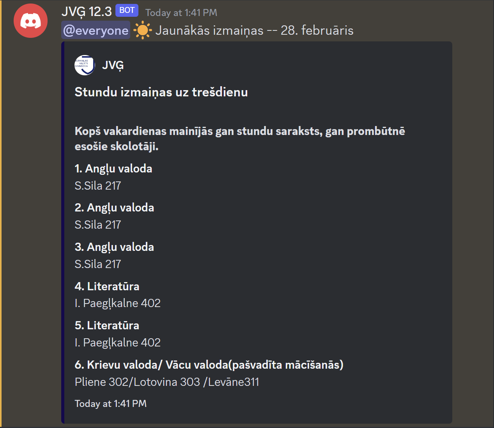
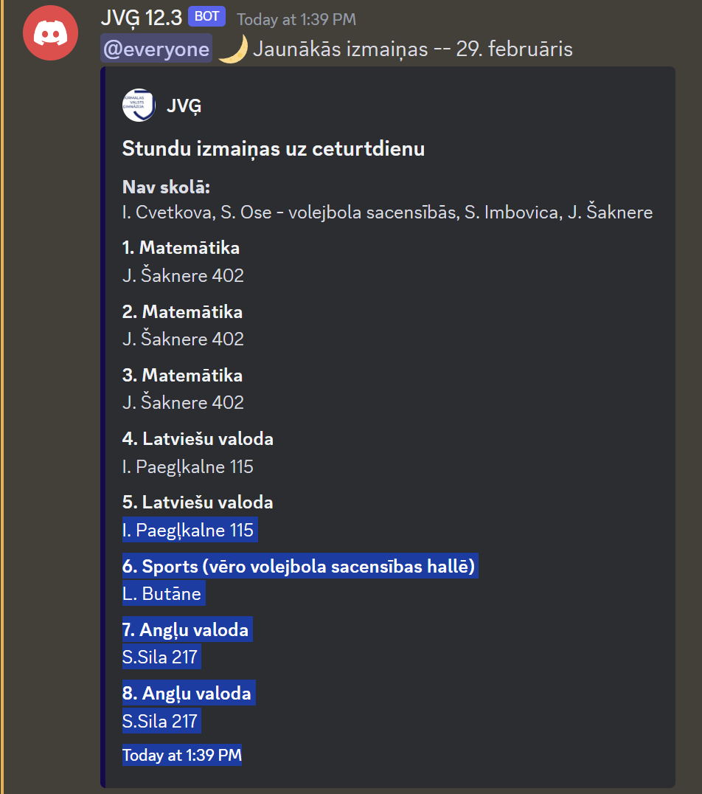

# class-schedule-bot

Single-purpose bot designed for a class Discord server. Pulls data from a Google Sheet with specific layout. Created primarily as a hobby prototype which later evolved into high school research project. Most code has been refactored and decoupled to be more presentable to the public.

## Usage

Set all the necessary variables in `.env` and run `npm install && npm start` to start the bot.

The bot will automatically send an embed containing recently scraped class schedule for the next day at 6:00 pm, local time. In the morning, data will be scraped once again to be compared and checked for any changes. User may use the `!schedule <day 1-5>` command to manually request the schedule for a particular day.

## Configuration and locale

The provided config is located in `./src/config`, tuned specifically for my school and grade. Cell and column addresses are acquired from the online [spreadsheet](https://docs.google.com/spreadsheets/d/1wyQulaigwo3-MqHwZYtB7Tk8UvLe6el8rCP0J_sv2VA). Recurrence rules are written in cron expressions. Locale strings are located in `./src/i18n` and used throughout the app.

## Showcase

     

          
     

     

          
     

## License

class-schedule-bot is licensed under the MIT License. Please consult the attached LICENSE file for further details.
